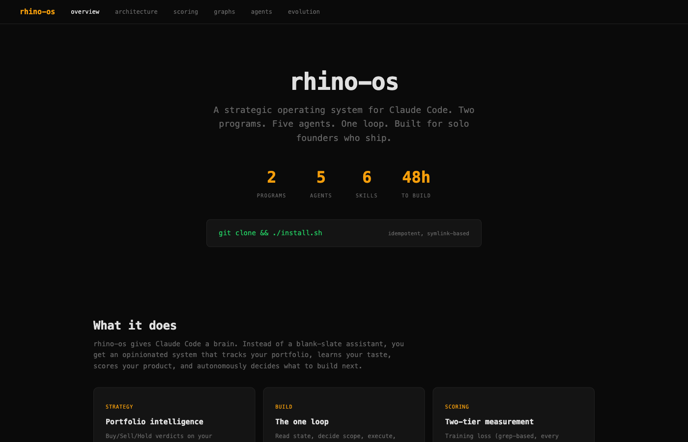
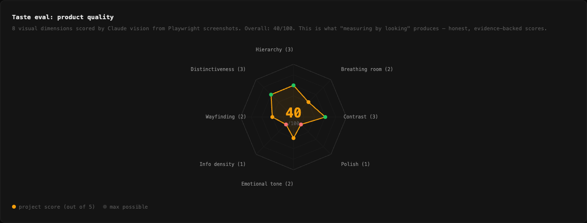
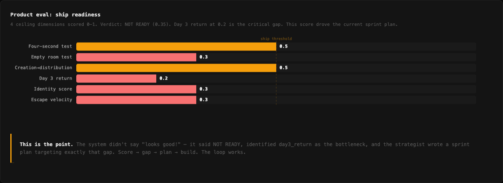
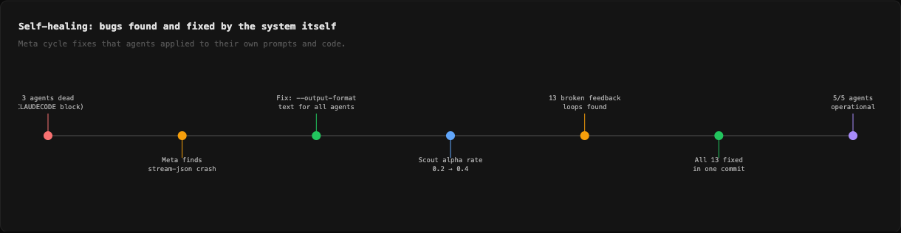
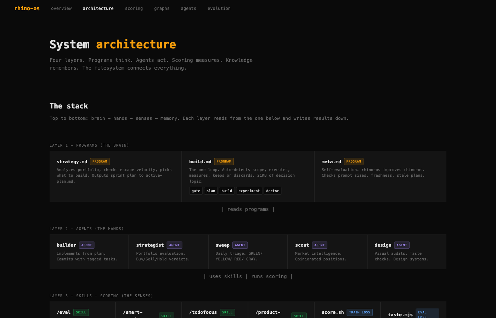

# rhino-os

**Your AI coding agent is powerful. But it has no memory, no strategy, and no taste.**

rhino-os fixes that. It's a brain for your AI coding agent — it decides what to build, builds it, scores the result, and learns from every cycle. You point it at a project and walk away.

Inspired by [Karpathy's autoresearch](https://github.com/karpathy/autoresearch) — the same modify-measure-keep/discard loop, applied to product development instead of ML training.



## The problem

AI coding agents (Claude Code, OpenClaw, etc.) are incredible at executing tasks. But they:
- Don't know what to build next
- Can't tell if what they built is actually good
- Forget everything between sessions
- Have no strategy — they just do what you tell them

rhino-os turns a task executor into a **self-improving product engineer.**

## How it works (30 seconds)

```
You: "run strategy"
rhino-os: scans your project, finds the biggest bottleneck, writes a sprint plan

You: "let's build"
rhino-os: builds it, scores the result, keeps or discards, logs what it learned

You: "rhino go ."
rhino-os: does both with no human gate. point it at a project and go to sleep.
```

That's it. Three commands.

## The loop

```
strategy → plan → build → score → keep or discard → repeat
    ↑                                                    |
    └────────────── learnings feed back ─────────────────┘
```

Every cycle, rhino-os gets smarter about your project. It remembers what worked, what didn't, and why.

## What's inside

### The loop (slash commands in Claude Code)

| Command | What it does |
|---------|-------------|
| `/strategy` | Finds the biggest bottleneck, writes a sprint plan |
| `/build` | Builds the plan, scores every change, keeps good ones, discards bad ones |
| `/experiment` | Autonomous hypothesis testing — informed search, not random guessing |
| `/eval` | Ship-readiness check — deterministic + functional + ceiling tests |
| `/design` | UI/UX audit against 11 taste dimensions, finds violations at file:line |
| `/sweep` | Daily health check — finds issues across all projects |
| `/scout` | Researches your market — what competitors do, what users expect |
| `/meta` | Grades its own agents. If one is broken, it fixes the prompt automatically |
| `/go` | Full autopilot — strategy + build + score, no human gate |

### Measurement (CLI)

| Command | What it does |
|---------|-------------|
| `rhino score .` | Instant structural quality check (2 seconds, free) |
| `rhino taste .` | Visual eval — takes screenshots, scores what it *sees* like a real user |
| `rhino bench` | Self-eval benchmark — runs the test suite across 5 tiers |
| `rhino status` | System health — workspace, agents, scores, sweep state |

### System

| Command | What it does |
|---------|-------------|
| `rhino setup .` | Onboard a project — detect type, configure, baseline score |
| `rhino install` | Install/update rhino-os — symlinks, hooks, settings |
| `rhino config` | Show current configuration from rhino.yml |
| `rhino dashboard` | Score + experiments + evals unified view |

### More slash commands

| Command | What it does |
|---------|-------------|
| `/score` | Structural score with trend and integrity warnings |
| `/taste` | Visual taste eval with weakest dimension and fix suggestion |
| `/status` | System dashboard — all projects, agents, scores |
| `/setup` | Onboard a new project |
| `/council` | Agent brain summary — what each agent recommends |
| `/docs` | Generate context documents (platform-docs, architecture, styleguide) |
| `/smart-commit` | Conventional commit tied to active plan |
| `/todofocus` | Am I on track? Scope enforcement |

## Proof it works

Real data from real agent runs. Not vanity metrics.

### Visual taste eval — 11 dimensions scored by Claude vision

The system takes Playwright screenshots of your app and scores what it *sees*. 40/100 here. Honest.



### Ship readiness — the system said NOT READY

Scored 0.35/1.0. Identified "Day 3 return" at 0.2 as the critical bottleneck. The strategist wrote a sprint plan targeting exactly that gap. It didn't tell us what we wanted to hear.



### Self-healing — 3 dead agents → 5/5 operational

Meta found that 3 agents were silently crashing. It diagnosed the root cause (CLAUDECODE env var blocking nested sessions), applied the fix, and verified all 5 agents came back online.



### System architecture — four layers

Programs think. Agents act. Skills + scoring measure. Knowledge remembers.



See [all 10 charts with real data →](docs/graphs.html)

## Install (2 minutes)

```bash
git clone https://github.com/rhinehart514/rhino-os.git ~/rhino-os
cd ~/rhino-os && ./install.sh
```

Then in any project:

```bash
cd ~/your-project
rhino setup .

# Open Claude Code and say:
#   "run strategy"  — to plan
#   "let's build"   — to build
#   "rhino go ."    — to do both
```

**Requirements:** [Claude Code CLI](https://docs.anthropic.com/en/docs/claude-code) with OAuth. macOS or Linux. Node 18+ for visual eval.

## Works with OpenClaw too

If you use [OpenClaw](https://github.com/openclaw/openclaw), rhino-os skills work out of the box.

**Why:** Both systems use the same `skills/*/SKILL.md` format. rhino-os ships 20 skills that OpenClaw can pick up directly — including `/build`, `/strategy`, `/sweep`, `/scout`, `/experiment`, `/design`, `/meta`, `/eval`, `/go`, and more.

**How to use with OpenClaw:**

```bash
# 1. Clone rhino-os
git clone https://github.com/rhinehart514/rhino-os.git ~/rhino-os

# 2. Copy the skills you want into your OpenClaw workspace
cp -r ~/rhino-os/skills/build ~/your-openclaw-workspace/skills/
cp -r ~/rhino-os/skills/strategy ~/your-openclaw-workspace/skills/

# 3. Copy the programs they reference
cp -r ~/rhino-os/programs ~/your-openclaw-workspace/

# 4. Copy the scoring script
cp ~/rhino-os/bin/score.sh ~/your-openclaw-workspace/bin/

# 5. Use them — say "/build" or "/strategy" in any OpenClaw channel
```

The scoring system (`score.sh`) is a standalone bash script with zero dependencies — it works anywhere.

> **Note:** Full agent orchestration (meta-grading, artifact verification, LaunchAgent automation) is Claude Code-native. OpenClaw users get the skills, scoring, and programs — which is the core value.

## Two-tier scoring

Like training loss vs eval loss in ML:

- **`rhino score .`** — fast, free, every commit. Checks build health, structure, hygiene. Think of it as a linter for your whole project.
- **`rhino taste .`** — slow, expensive, on demand. Takes real screenshots and scores what it *sees*. 11 dimensions scored 1-5 (including layout coherence and information architecture). This is how you know if your app is actually good.

## Six agents, one filesystem

Agents don't call each other. They communicate by reading and writing files:

```
Strategist  →  writes plans       →  Builder reads them
Builder     →  writes scores      →  Strategist reads them next cycle
Sweep       →  writes state       →  Strategist reads it
Scout       →  writes positions   →  Builder reads them
Meta        →  grades everyone    →  fixes broken prompts
```

If one agent fails, the others keep working. Meta catches silent failures within 48 hours.

## Anti-gaming (scores you can trust)

AI agents love to game metrics. rhino-os fights back:

- **Cosmetic-only detection** — moved some comments around but nothing real? Flagged.
- **Inflation cap** — score jumped 15+ points in one commit? Warning.
- **Plateau detection** — same score for 5 runs? You're stuck, not stable.
- **Stage ceilings** — your MVP scoring 95/100? Something's wrong.

Scores are diagnostic instruments, not goals.

## Knowledge compounds

Every session builds on the last:
- Experiment learnings (what worked, what didn't, and why)
- Market positions (evidence-backed strategic claims)
- Design preferences (accumulated taste signals)
- Session context (last session summary injected into the next one)

## Customize everything

| File | What it controls |
|------|-----------------|
| `config/rhino.yml` | Budgets, scoring thresholds, integrity guards |
| `agents/*.md` | Agent prompts — edit directly to change behavior |
| `programs/*.md` | Multi-step workflows — the actual brain |
| `skills/*/SKILL.md` | Slash command entry points |

See [docs/CUSTOMIZATION.md](docs/CUSTOMIZATION.md) for details.

## Uninstall

```bash
./uninstall.sh  # removes symlinks + LaunchAgents, keeps your knowledge files
```

## License

[MIT](LICENSE)
