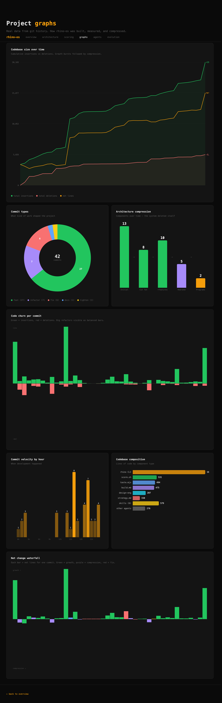

# rhino-os

A strategic operating system for [Claude Code](https://docs.anthropic.com/en/docs/claude-code). Five agents that learn your taste, score your product, and decide what to build next.

```
git clone https://github.com/rhinehart514/claude-code-os.git ~/rhino-os
cd ~/rhino-os && ./install.sh
```

## See it work

**[Live docs with graphs, architecture, and scoring breakdowns](https://rhinehart514.github.io/claude-code-os/)**

<p align="center">
  <a href="https://rhinehart514.github.io/claude-code-os/graphs.html">
    
  </a>
</p>

The graphs page renders real data from git history — codebase growth, commit churn, architecture compression from 13 agents down to 5, and velocity patterns. No mock data.

## What it actually does

| Command | What happens |
|---------|-------------|
| `rhino strategy` | Scans your projects, gives Buy/Sell/Hold verdicts, writes a sprint plan |
| `rhino build` | Auto-detects mode: gate, plan, build, or experiment. Measures before and after. |
| `rhino sweep` | Daily triage. Classifies issues GREEN/YELLOW/RED. Fixes safe ones inline. |
| `rhino scout` | Updates market positions with evidence. Agents reason FROM these. |
| `rhino score .` | Structural lint (free, 2 sec). Build health, structure, hygiene. |
| `rhino taste .` | Visual eval via Playwright + Claude vision. Scores what it SEES. |
| `rhino meta` | Grades its own agents. Fixes broken prompts. Agents can't silently die. |

## The loop

```
strategy → sprint plan → build (change → score → keep/discard) → eval → strategy
```

Scores feed forward. Gaps become sprint priorities. The weakest dimension drives the next build cycle. Knowledge compounds across sessions — taste signals, market positions, design preferences all persist and strengthen.

## Proof it works

- **13 → 5 agents** — the system deleted itself into shape ([see compression graph](https://rhinehart514.github.io/claude-code-os/graphs.html))
- **3 meta cycles** — agents grade each other, broken prompts get fixed automatically
- **Self-healing** — if an agent runs but doesn't write its outputs, meta catches it within 48h
- **Two-tier scoring** — training loss (grep, every commit) vs eval loss (screenshots + vision, on demand) ([scoring breakdown](https://rhinehart514.github.io/claude-code-os/scoring.html))

## Install

Requires [Claude Code CLI](https://docs.anthropic.com/en/docs/claude-code) with OAuth auth. macOS or Linux. Node 18+ for visual eval.

```bash
./install.sh              # idempotent, symlink-based
./install.sh --no-launchd # skip macOS LaunchAgents
rhino status              # verify
```

The installer symlinks agents, skills, rules, and hooks into `~/.claude/`, merges configs, and links the `rhino` CLI to `~/bin/rhino`.

## Architecture

```
Programs (brain)     →  strategy.md, build.md, meta.md
Agents (hands)       →  strategist, builder, sweep, scout, design-engineer
Knowledge (memory)   →  portfolio.json, landscape.json, taste.jsonl
Scoring (eyes)       →  score.sh (training loss) + taste.mjs (eval loss)
```

Agents communicate through the filesystem. No direct calls. Sweep writes state, strategist reads it next run. [Full architecture →](https://rhinehart514.github.io/claude-code-os/architecture.html)

## Uninstall

```bash
./uninstall.sh  # removes symlinks + LaunchAgents, preserves knowledge files
```

## License

MIT
